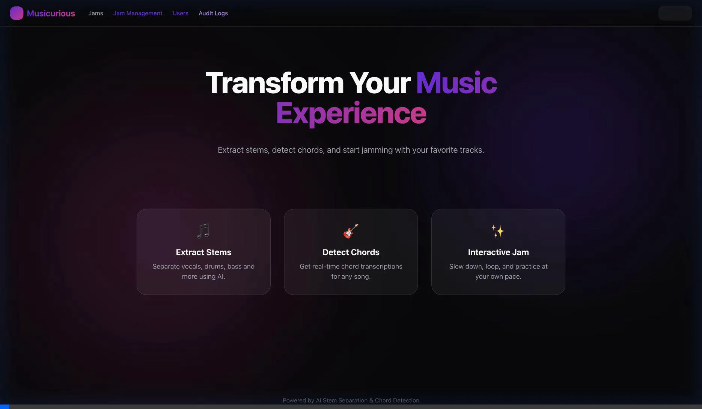
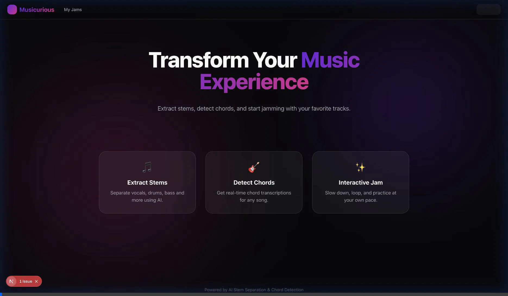

# Musicurious AI

Musicurious AI is an advanced music practice and collaboration platform designed to help musicians dissect, practice, and learn from "jams". It features AI-powered stem separation, chord recognition, and interactive practice tools.

## Features

- **Jam Library**: Submit, manage, and search for jams.
- **AI Processing**: Automated stem separation (Vocals, Drums, Bass, Guitar) using Demucs.
- **Interactive Player**:
    -   Solo/Mute stems.
    -   Pitch shifting and Tempo control (independent).
    -   Looping and Section Extraction.
- **Musical Flow Canvas**: A visual node-based editor to map out the structure of a song/jam.
    -   **PDF Export**: Download your musical flow designs as PDF documents.
- **Chord Recognition**: Detects chords from audio and visualizes them on the timeline and canvas.
- **User Isolation**: Personal library management where annotations, sections, and settings are private to each user.
- **Audit Logging**: Comprehensive tracking of user actions for administrative review.
    -   Admin Dashboard (`/admin/audit`) to view and filter logs.

## Visual Walkthroughs

### 1. Searching and Opening a Jam
Navigate through your library and quickly find the music you want to practice.


### 2. Interactive Player
Control every aspect of the track. Solo instruments, muted drums, or change the tempo/pitch to suit your practice needs.



## Getting Started

### Prerequisites

-   **Node.js**: v18+
-   **PostgreSQL**: Local or Remote (e.g., Vercel Postgres).
-   **Python 3.8+**: Required for Demucs (audio processing).
    -   `pip install demucs`

### Installation

1.  Clone the repository:
    ```bash
    git clone https://github.com/your-repo/musicurious-ai.git
    cd musicurious-ai
    ```

2.  Install dependencies:
    ```bash
    npm install
    ```

3.  Set up Environment Variables:
    Create a `.env.local` file with the following keys:
    ```env
    POSTGRES_URL="..."
    POSTGRES_PRISMA_URL="..."
    POSTGRES_URL_NON_POOLING="..."
    POSTGRES_USER="..."
    POSTGRES_HOST="..."
    POSTGRES_PASSWORD="..."
    POSTGRES_DATABASE="..."
    
    NEXT_PUBLIC_CLERK_PUBLISHABLE_KEY="..."
    CLERK_SECRET_KEY="..."
    ```

4.  Run the Development Server:
    ```bash
    npm run dev
    ```

5.  (Optional) Run Database Migrations:
    If setting up for the first time, check `scripts/` for migration helpers or use the `db:setup` script if available.

## Commercial License Audit

This project uses several open-source libraries. If you plan to deploy this project commercially, please review the following important licensing notes:

### ⚠️ Critical Attention Required

#### 1. Demucs (Audio Separation)
-   **Library License**: MIT (Commercial use allowed).
-   **Model Weights License**: **CC-BY-NC 4.0 (Attribution-NonCommercial)**.
-   **Implication**: The default pre-trained models provided with Demucs are generally intended for **research and personal use only**. Using these specific weights for a commercial product may violate the license. You would likely need to:
    -   Train your own models on commercially usable datasets.
    -   Contact Meta/Facebook Research for a commercial license.
    -   Verify if specific "commercial-friendly" model checkpoints exist.

#### 2. React Flow / xyflow (@xyflow/react)
-   **License**: MIT (Core library).
-   **Attribution**: The MIT license requires preserving copyright notices.
-   **Pro Requirement**: If you are using the `proOptions={{ hideAttribution: true }}` prop to remove the "React Flow" watermark, you **must** have a valid **React Flow Pro** subscription. Hiding the attribution without a subscription is against their terms for commercial usage.

### Safe for Commercial Use (MIT/Apache/ISC)
The following key libraries use permissive licenses (MIT, ISC, Apache-2.0) which generally allow commercial use without significant restrictions, provided copyright notices are kept:
-   **Next.js** (MIT)
-   **React & React DOM** (MIT)
-   **Tone.js** (MIT)
-   **Tailwind CSS** (MIT)
-   **Clerk** (MIT - Commercial Service)
-   **Lucide React** (ISC)
-   **Postgres / Vercel SDKs** (MIT/Apache-2.0)

*(Disclaimer: This audit is for informational purposes only and does not constitute legal advice. Please consult with a legal professional for full compliance.)*

## License

This project's original source code is licensed under the **MIT License**.

> [!NOTE]
> See the [LICENSE](LICENSE) file for the full text of the MIT license covering the source code created for this project.

### Comparison of Rights

| Component                                | License          | Commercial Use?          |
| :--------------------------------------- | :--------------- | :----------------------- |
| **Project Source Code** (UI, logic, API) | **MIT**          | ✅ Yes                    |
| **Demucs Library** (@facebookresearch)   | MIT              | ✅ Yes                    |
| **Demucs Model Weights**                 | **CC-BY-NC 4.0** | ❌ **No** (Research Only) |
| **React Flow** (Core)                    | MIT              | ✅ Yes (with attribution) |
| **React Flow Pro** features              | Commercial       | ⚠️ Requires Subscription  |

**Important**: The MIT license of this project **does not** extend to the pre-trained weights/models used by dependencies such as Demucs. You act as the licensee for satisfied dependencies. Please consult the "Commercial License Audit" section above for more details.
